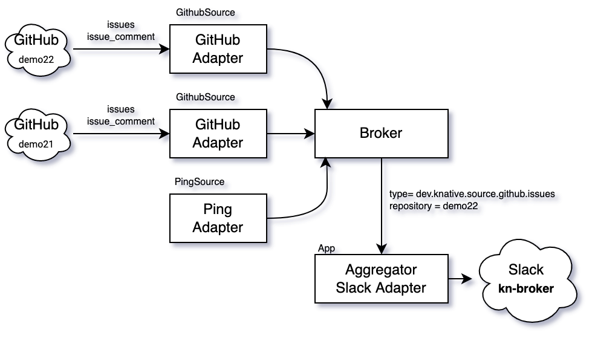

# Basic Eventing Patterns

This projects explore several basic [Knative Eventing](https://knative.dev/docs/eventing/) patterns via an 
application mirroring GitHub issues to Slack


## Installing

Run these scripts, in order:
1. **0-setup.sh**: create a `kind` cluster and install core Knative Serving and Eventing using
   [`kn quickstart`](https://knative.dev/docs/install/quickstart-install/)
2. **1-addons.sh**: install the required add-ons to run the demo:
   * GitHubSource
   * Strimzi (this is not a Knative add-on)
   * KafkaChannel
   * KafkaBroker
3. **3-deploy.sh**: deploy the demo. This scripts looks for 2 environment variables:
   * GITHUB_TOKEN: your GitHub [personal access token](https://github.com/settings/tokens)
   * SLACK_TOKEN: the [slack token](https://api.slack.com/authentication/oauth-v2) for your slack app.
     See [Slack 101](./doc/slack.md) for more information.

The default configuration listens for events coming from [knativecon/demo22](https://github.com/knativecon/demo22).

## Patterns

### Pattern 1: direct delivery

#### Topology 


#### Steps

1. Create a GitHub issue. 
   * Title: `There is a bug.` 
   * Body: `Help me, please!`
2. Observe Slack notifications in `kn-direct`
 
#### Pros and Cons

- Pro: easy to use
- Pro: lightweight
- Con: no ordering guarantee
- Con: events can be lost

### Pattern 2: queue, ordered

#### Topology
 


#### Steps

1. Add a comment to the previous created GitHub issue
   * Body: `sorry for the delay`
2. Add another comment (don't wait too long):
   * Body: `no worries`
3. In `kn-direct` slack channel, observe the comments being out-of-order
4. In `kn-channel` slack channel, observe the comments being in-order

**Note**: Both GitHub and the GitHub adapter don't guarantee ordering. 

#### Pros and Cons

- Pro: event order is preserved (see notes below)
- Con: external dependency (in this example Apache Kafka)
- Con: events can be lost

### Pattern 3: retries 

#### Topology


#### Delivery Specification

```yaml
...
spec:
  delivery:
    backoffDelay: PT1S
    backoffPolicy: linear
    retry: 5
...
```


#### Steps

1. Add a comment `so many errors!`
2. Wait 3s
3. In `kn-direct` slack channel, observe no comments have been added
4. In `kn-channel` slack channel, observe the comment has been added

#### Pros and Cons

- Pro: no event left behind
- Con: some events left behind (see below)

### Pattern 4: Dead Letter Sink

#### Topology


#### Delivery Specification

```yaml
...
deadLetterSink:
  ref:
    apiVersion: serving.knative.dev/v1
    kind: Service
    name: slack-dls
```

#### Steps

1. Add a comment `some are permanent errors`
2. Wait 3s
3. In `kn-direct` slack channel, observe no comments have been added
4. In `kn-channel` slack channel, observe no comments have been added
5. In `kn-dls` slack channel, observe the comment has been added

#### Pros and Cons

- Pro: no event left behind

### Pattern 5: broker vs channel 

#### Topology



